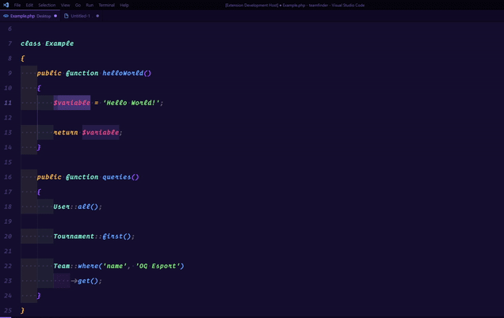

# quick-ray-dumper :flying_saucer:

This extension helps you to generate [spatie/ray](https://spatie.be/docs/ray/v1/usage/reference) debug syntax, no longer need to type manually :fire:.




## Support Syntax
- PHP
- Laravel
- More coming soon.

## Supported Command

Ray: Variable - Display a string, array or object (*ctrl+alt+p* command shortcut)
```PHP
ray($variable);
```

Ray: Views - Display all views
```PHP
ray()->showViews();
```

Ray: Env - Display environment variables
```PHP
ray()->env();
```

Ray: Requests - Display all requests
```PHP
ray()->showRequests();
```

Ray: Model - Display the attributes and relations of a model
```PHP
ray()->model($model);
```

Ray: Carbon - Send Carbon instances to Ray
```PHP
ray()->carbon($carbon);
```

Ray: Classname - Send the classname of an object to Ray
```PHP
ray()->className($object);
```

Ray: Backtrace - Check entire backtrace
```PHP
ray()->backtrace();
```

Ray: Caller - Discover where code is being called
```PHP
ray()->caller();
```

Ray: Clear Screen - Clear current screen
```PHP
ray()->clearScreen();
```

Ray: Clear All - Clear current and all previous screens
```PHP
ray()->clearAll();
```

Ray: Count - Count how many times a piece of code is called
```PHP
ray()->count();
```

Ray: Measure - Display runtime and memory usage
```PHP
ray()->measure();
```

Ray: Pause - Pause execution
```PHP
ray()->pause();
```

Ray: PHP Info - Display PHP info
```PHP
ray()->phpinfo();
```

Ray: Separtor - Add a visual separator
```PHP
ray()->separator();
```

Ray: Trace - Check entire backtrace
```PHP
ray()->trace();
```

Ray: Exception - Display extended information about an Error or Exception
```PHP
ray()->exception($e);
```

Ray: HTML - Send HTML to Ray
```PHP
ray()->html($html);
```

Ray: Image - Display an image in Ray
```PHP
ray($variable);
```

Ray: JSON - Send JSON to Ray
```PHP
ray()->image($path);
```

Ray: Text - Display the raw text for a string while preserving whitespace formatting
```PHP
ray()->text($string);
```

Ray: XML - Display formatted XML in Ray
```PHP
ray()->xml($xmlString);
```

Ray: Queries - Display all queries that are executed
```PHP
ray()->showQueries();
```

Ray: Queries (Callback) - Display all queries that are executed in Callback
```PHP
ray()->showQueries(function() {
    User::all(); // this query will be displayed.
});
```

Ray: Stop Show Queries - Stop displaying queries
```PHP
ray()->stopShowingQueries();
```

Ray: Count Queries - Count all queries that are executed within a callable
```PHP
ray()->countQueries(function() {
    User::all();
    User::all();
    User::all();
});
```

Ray: Duplicate Queries - Display all duplicated queries that are executed
```PHP
ray()->showDuplicateQueries();
```

Ray: Stop Show Duplicated Queries - Stop displaying duplicated queries
```PHP
ray()->stopShowingDuplicateQueries();
```

Ray: Duplicate Queries (callback) - Display all duplicated queries that are executed in callback
```PHP
ray()->showDuplicateQueries(function() {
    User::where('id', 1)->get('id');
    User::where('id', 1)->get('id'); // this query will be displayed.
});
```

Ray: Slow Queries - Display all queries that take longer than N milliseconds to execute
```PHP
ray()->showSlowQueries(100);
```

Ray: Slow Queries (callback) - Display all queries that take longer than N milliseconds to execute in callback
```PHP
ray()->showSlowQueries(100, function() {
    User::where('id', 1)->get('id'); // this query will be displayed if it takes longer than 100ms.
});
```

Ray: Events - Display all events that are executed
```PHP
ray()->showEvents();
```

Ray: Stop Show Events - Stop Displaying all events that are executed
```PHP
ray()->stopShowingEvents();
```

Ray: Events (Callback) - Display all events that are executed in callback
```PHP
ray()->showEvents(function() {
    event(new MyEvent()); // this event will be displayed.
});
```

Ray: Jobs - Display all jobs that are executed
```PHP
ray()->showJobs();
```

Ray: Stop Show Jobs - Stop Displaying jobs
```PHP
ray()->stopShowingJobs();
```

Ray: Jobs (Callback) - Display all jobs that are executed in callback
```PHP
ray()->showJobs(function() {
    dispatch(new TestJob()); // this job will be displayed.
});
```

Ray: Cache - Display all cache events that are executed
```PHP
ray()->showCache();
```

Ray: Stop Show Cache - Stop displaying cache
```PHP
ray()->stopShowingCache();
```

Ray: Http Client Requests - Display all http client requests that are executed
```PHP
ray()->showHttpClientRequests();
```

Ray: Stop Show Http Client Requests - Stop displaying http client requests
```PHP
ray()->stopShowingHttpClientRequests();
```

Ray: Http Client Requests (callback) - Display all http client requests that are executed in callback 
```PHP
ray()->showHttpClientRequests(function() {
    Http::get('https://example.com'); // this request will be displayed.
});
```

## Credits
- https://spatie.be/docs/ray/v1/introduction
- https://github.com/LuisEGR/console-log-vscode


